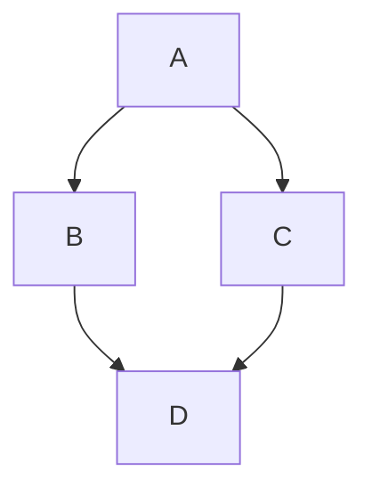

# 📝 Marky - Simple & Free Markdown Editor

A powerful WYSIWYG markdown editor that runs entirely in your browser. No installation, no sign-up required!

**The ultimate tool for collaborative document workflows.** Marky lets you create markdown documents and export them as **fully editable HTML files** that anyone can modify and return to you. Perfect for spec-driven AI development, stakeholder reviews, and collaborative editing - share HTML exports with colleagues who can edit and send back their changes as markdown.

## 🚀 Try It Now

**[Launch Marky Editor](https://marky-md.web.app/)** - Start editing markdown instantly!

## ✨ What You Can Do

### 📋 Import Your Content
- **Paste from Clipboard** - Click "Paste MD" to load markdown directly from your clipboard
- **Upload Files** - Import existing `.md`, `.markdown`, or `.txt` files with one click

### ✏️ Edit with Ease
- **WYSIWYG Editing** - See your formatted text as you type, no preview pane needed
- **Formatting Toolbar** - Select any text to reveal formatting options (headings, bold, italic, lists, code blocks)
- **Live Updates** - Changes appear instantly as you type
- **Auto-Save** - Your work is automatically saved to your browser every second
- **Dark Mode** - Toggle between light and dark themes, or let it follow your system preference
- **Clear Document** - Start fresh with a single click

### 💾 Export Your Work
- **Download as Markdown** - Save your work as a `.md` file
- **Copy to Clipboard** - Instantly copy all your markdown with one click
- **Export as HTML** - Generate standalone, **fully editable** HTML files that recipients can modify and send back. Perfect for collaborative workflows - they can edit the HTML directly in their browser, make changes, and return it to you as markdown!
- **Export as PDF** - Generate professional, print-ready PDF documents with one click. Images are automatically optimized to ensure reasonable file sizes while maintaining quality

### 🎨 What You Can Format
- **Headings** (H1, H2, H3) - Organize your content with hierarchy
- **Bold & Italic** - Emphasize important text
- **Lists** - Create bullet points or numbered lists
- **Code Blocks** - Display code snippets beautifully
- **Tables** - Organize data in structured tables
- **Links & Images** - Add hyperlinks and embed images
- **Blockquotes** - Highlight quotes or important notes
- Mermaid diagrams
- Latex math formulas

### Mermain examples


### LaTeX examples
```latex
$$\mathbb{N} = \{ a \in \mathbb{Z} : a > 0 \}$$
```

$$\mathbb{N} = \{ a \in \mathbb{Z} : a > 0 \}$$

## ⌨️ Keyboard Shortcuts

Make your workflow even faster:

- **Ctrl+S** (Cmd+S on Mac) - Download as markdown file
- **Ctrl+O** (Cmd+O on Mac) - Upload/open a markdown file
- **Ctrl+Shift+P** (Cmd+Shift+P on Mac) - Export as PDF file
- **Ctrl+Z** (Cmd+Z on Mac) - Undo
- **Ctrl+Y** or **Ctrl+Shift+Z** (Cmd+Shift+Z on Mac) - Redo

## 🎯 Perfect For

- 📚 Writing README files for GitHub projects
- 📖 Creating documentation and guides
- 📝 Taking notes and writing articles
- ✍️ Drafting blog posts in markdown
- 📊 Creating technical documentation
- 🎓 Academic writing and research notes
- 🤖 **Collaborative Workflows** - Export as editable HTML, share with colleagues who can make changes directly in their browser, then receive their edits back as markdown
- 🔄 **Spec-Driven AI Development** - Create specs, export as editable HTML for stakeholder review and editing, receive their modified versions back, and seamlessly continue your AI development workflow

## ✨ Features

- ✅ **Editable HTML Exports** - Recipients can edit exported HTML files and send changes back
- ✅ **No Account Required** - Start using immediately
- ✅ **Works Offline** - After first load, works without internet
- ✅ **No Data Sent to Servers** - All editing happens locally in your browser
- ✅ **Free Forever** - No subscriptions, no hidden fees
- ✅ **Open Source** - Transparent and community-driven
- ✅ **Dark Mode** - Automatic theme switching based on system preference, with manual override

## 🛠️ Quick Start Guide

1. **Open the editor** - Visit [marky-md.web.app](https://marky-md.web.app/)
2. **Start typing** - Your content appears formatted in real-time
3. **Select text** - Use the formatting toolbar for quick styling
4. **Save your work** - Click "Download MD" or use Ctrl+S to export

That's it! No tutorials needed.

## 🌟 Why Marky?

Unlike other markdown editors:
- **Editable HTML exports** - Share documents that recipients can modify and return
- No complicated split-pane views - just pure WYSIWYG
- No account creation or login required
- Completely self-contained - one HTML file does it all
- Lightning fast - no server roundtrips
- Your markdown data never leaves your device

## 💡 Pro Tips

- Select any text to see the formatting toolbar appear above it
- Use the "Paste MD" button to quickly load markdown from anywhere
- Your work auto-saves to localStorage - but download important files as a backup
- Click "Clear" to start fresh with a new document
- Toggle dark mode in the toolbar or let it automatically match your system theme
- **Collaborative HTML Workflow**: Export as HTML and share with colleagues. They can open it in any browser, edit the content directly, save their changes, and send the modified HTML back to you. You can then extract their changes as markdown!

## 🤝 For Developers

Built with vanilla JavaScript and modern web standards. Check out the [GitHub repository](https://github.com/Tommertom/marky) to:
- Report bugs or issues
- Suggest new features
- Contribute code improvements
- Fork and customize for your needs

## 📄 License

Free and open source under the MIT License.

---

**Ready to write?** [Launch Marky Editor Now →](https://marky-md.web.app/)
